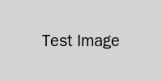

# 1. Термины и определения

:::terms
| Термин | Определение |
|--------|-------------|
| Скриншот | Снимок экрана |
| UI | Пользовательский интерфейс |
:::

# 2. Исходные данные

Данный документ создан для тестирования вставки изображений в генератор ЧТЗ.

# 3. Описание изменений

:::changes-table
| Описание функции «Как есть» | Описание функции «Как будет» |
|-----------------------------|------------------------------|
| Изображения не поддерживаются | Изображения вставляются корректно |
:::

# 4. Описание требований

## 4.1 Тест изображения с размером по умолчанию

Ниже представлен скриншот интерфейса:

Это изображение должно отобразиться по центру с размером по умолчанию.

## 4.2 Тест изображения с заданной шириной

Изображение с шириной 50%:

{width="50%"}

Изображение с шириной 300px:

{width="300px"}

## 4.3 Функциональная таблица с упоминанием изображения

:::function-table{#func-image-test}
function: Отображение скриншотов в документации
task: TEST-001
taskUrl: https://jira.example.com/browse/TEST-001
scenario: |
  **Предусловия:**
  - Документ содержит изображения
  - Изображения находятся в папке images/

  **Основной сценарий:**
  1. Пользователь открывает документ
  2. Система отображает изображения
  3. Изображения центрируются на странице
  4. Размеры изображений соответствуют заданным

  **Ограничения:**
  - Поддерживаются форматы: PNG, JPG, GIF
  - Максимальная ширина изображения: 600px
:::

# 5. Требования к интерфейсу

Интерфейс должен отображать изображения корректно, как показано выше.

# 6. Требования к интеграции

:::empty-section
Интеграции не требуются.
:::

# 7. Изменения ролевой модели

:::empty-section
Изменения ролевой модели не требуются.
:::

# 8. Требования к отчётности

:::empty-section
Отчётность не требуется.
:::

# 9. Требования к миграции данных

:::empty-section
Миграция данных не требуется.
:::

# 10. Приложения

Все скриншоты приложены к документу.
